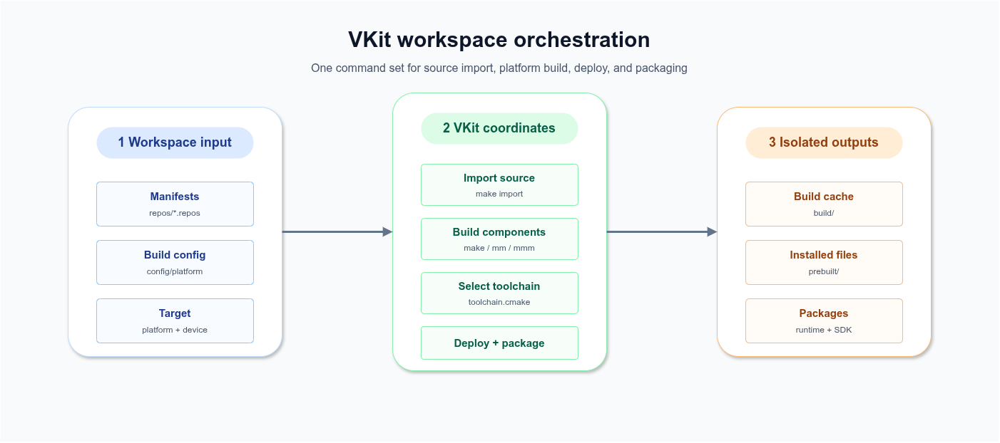
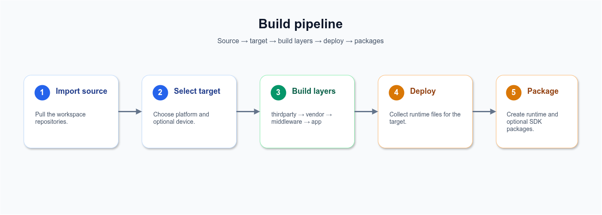

# VKit

**Cross-platform build and delivery tool for the [VLink](https://vlink.work) workspace**

   

English | [中文](../../README.md) · [Website](https://vlink.work) · [Changelog](CHANGELOG.md) · [License](LICENSE)

VKit is the unified build entry point for a VLink workspace. It brings multi-repo source import, cross-platform toolchains, layered components, deployment directories, and SDK / Runtime packaging into one command set across Linux / QNX / Android / macOS / Windows.

<p align="center"></p>

---

## 1. Core Capabilities

| Capability | Description |
| --- | --- |
| Multi-platform build | `VKIT_PLATFORM` selects the target; VKit dispatches CMake toolchain and install prefix |
| Per-device isolation | `VKIT_DEVICE` creates a device layer; artifacts are isolated by `<platform>-<device>` |
| Layered orchestration | Components build in `thirdparty → vendor → middleware → app` order while keeping normal CMake projects |
| Single-component iteration | Use `mm` / `mmm` inside a component directory without writing build paths |
| Delivery packaging | `make` produces runtime; `make deploy_sdk` also produces SDK |

VKit does not replace CMake or act as a general package manager. It standardizes how a multi-repo, multi-platform, multi-device VLink workspace builds and ships.

Use VKit when:

- One workspace contains multiple repositories with a fixed build order.
- The same source tree must ship to multiple target platforms or device variants.
- Local single-component iteration and CI packaging should use the same entry points.

Use something lighter when:

- You only need third-party dependency versioning; Conan / vcpkg may be a better fit.
- The project is a small single-repository, single-platform CMake project.

---

## 2. Quick Start

### 2.1 Host prerequisites

Ubuntu 22.04 is recommended; Ubuntu 20.04 is the minimum.

```bash
sudo apt-get -y install \
    git git-lfs \
    autoconf automake tclsh \
    build-essential ninja-build \
    ccache rsync \
    python3 openjdk-17-jdk \
    doxygen graphviz
sudo pip install vcs2l
```

`cmake / ripvcs / protoc / flatc / fastddsgen` are shipped with the repository and added to `PATH` by `vkit-setup.sh`.

Dependency roles:

| Type | Tools | Purpose |
| --- | --- | --- |
| System tools | `git`, `git-lfs`, `ninja`, `ccache`, `rsync` | Source import, build acceleration, and deploy sync |
| Generators | `openjdk-17-jdk`, `doxygen`, `graphviz` | Code generation and documentation |
| Bundled tools | `cmake`, `ripvcs`, `protoc`, `flatc`, `fastddsgen` | Used automatically after sourcing the environment |

### 2.2 Pull source

```bash
git clone <vkit-url> vkit && cd vkit

$EDITOR repos/full/*.repos

make import_full
```

Source sets:

| Set | Content | Use case |
| --- | --- | --- |
| `full` | `vmsgs + vlink` | Build VLink from scratch |
| `dev` | `vmsgs` | Local `middleware/vlink/` already exists |

For the developer set:

```bash
make import_dev
```

### 2.3 Select target platform

`VKIT_PLATFORM=auto` is the default. Common targets need only the matching environment:

```bash
# Linux x86_64 (host)        no extra setup
# Linux aarch64 (cross)      export CROSS_COMPILE_PREFIX=/opt/.../bin/aarch64-none-linux-gnu-
# QNX                        source ~/.qnx/qnxsdp-env.sh
# Android                    export ANDROID_NDK=/opt/android-ndk-r27
```

For targets such as `qnx-x86_64` or `android-x86_64`, set `VKIT_PLATFORM` explicitly:

```bash
export VKIT_PLATFORM=qnx-x86_64
```

### 2.4 Build

```bash
source vkit-setup.sh
make
```

`make` builds components in configured order and produces a runtime package. To produce an SDK package:

```bash
make deploy_sdk
```

---

## 3. Workspace Model

### 3.1 Platform, device, and directories

`VKIT_PLATFORM` is the target platform, such as `linux-aarch64`. `VKIT_DEVICE` is an optional device layer, such as `myecu`.

Both form `VKIT_DEVICE_PLATFORM`, which isolates artifacts:

```text
build/<DEVICE_PLATFORM>/
prebuilt/<DEVICE_PLATFORM>/
prebuilt-private/<DEVICE_PLATFORM>/
packup/<DEVICE_PLATFORM>/
```

The same source tree can maintain multiple platforms or devices by using different shell environments.

### 3.2 Build pipeline

<p align="center"></p>

| Layer | Command | Config |
| --- | --- | --- |
| thirdparty | `mm_thirdparty` | `thirdparty.cfg` |
| vendor | `mm_vendor` | `vendor.cfg` |
| middleware | `mm_middleware` | `middleware.cfg` |
| app | `mm_app` | `app.cfg` |

Each `.cfg` line describes one component:

```cfg
middleware/my-component; -DBUILD_SHARED_LIBS=ON -DMY_FEATURE=ON
```

The path before `;` is the component path. The text after `;` is passed to CMake.

### 3.3 Artifact types

| Artifact | Description |
| --- | --- |
| `prebuilt/<DEVICE_PLATFORM>/` | Deployable target files |
| `prebuilt-private/<DEVICE_PLATFORM>/` | Build/link-only dependencies, excluded from runtime |
| `vkit-<DEVICE_PLATFORM>-runtime.tgz` | Runtime package for target deployment |
| `vkit-<DEVICE_PLATFORM>-sdk.tgz` | SDK package for offline development or downstream builds |

The runtime package targets deployment and keeps the required `target/` contents. The SDK package keeps CMake config, host tools, and development dependencies on top of runtime content for offline integration or downstream builds.

### 3.4 Public and private install prefixes

| Prefix | Purpose | In runtime |
| --- | --- | --- |
| `prebuilt/<DEVICE_PLATFORM>/` | Business executables, shared libraries, configs, and resources | Yes |
| `prebuilt-private/<DEVICE_PLATFORM>/` | Build/link-only dependencies such as static libraries, headers, or internal tools | No |

Components that only provide build-time dependencies should install into `prebuilt-private/` so development content does not enter the runtime package.

---

## 4. Daily Commands

### 4.1 Single-component build

```bash
source vkit-setup.sh
cd middleware/vlink

mmm                         # build with cfg options
mm '-DENABLE_VIEWER=ON'     # pass options directly
mm clean                    # clean current component
```

After changing configure options, clean the current component before rebuilding.

| Command | Use |
| --- | --- |
| `mmm` | Build current component with its `.cfg` options |
| `mm` | Build current component and optionally pass temporary options |
| `llcfg` | Show the `.cfg` options matched by the current component |
| `mmc` / `mmmc` | Run clang-tidy during a single-component build |
| `rdb` | Debug through the GDB wrapper for the target platform |

### 4.2 Batch build

```bash
mm_thirdparty
mm_vendor
mm_middleware
mm_app
mm_all                      # same as make install
```

### 4.3 Make entries

| Command | Use |
| --- | --- |
| `make` | Build and produce runtime |
| `make install` | Build only |
| `make deploy` | Deploy and package runtime |
| `make deploy_sdk` | Deploy and produce SDK |
| `make import_full` | Pull full source set |
| `make import_dev` | Pull developer source set |
| `make pull` | Update existing repositories |
| `make clean` | Clean current platform build dirs |
| `make dclean` | Clean current platform build and artifact dirs |
| `make aclean` | Clean all platform artifacts |

Switching platform or device usually does not require cleanup because VKit isolates directories by `VKIT_DEVICE_PLATFORM`. Cleanup is mainly needed after changing configure options, when debugging cache issues, or before producing clean artifacts.

---

## 5. Onboarding and Customization

### 5.1 Add a component

Register the repository in `repos/<dev|full>/<layer>.repos`:

```yaml
repositories:
  middleware/my-component:
    type: git
    url: <git-url>
    version: <branch-or-tag>
```

Add the build entry to `config/<platform>/<layer>.cfg`:

```cfg
middleware/my-component; -DBUILD_SHARED_LIBS=ON
```

The component should provide one of `CMakeLists.txt`, `cmake/CMakeLists.txt`, `build.sh`, or `Makefile`.

### 5.2 Add a link-only dependency

Dependencies that are only needed for compile or link time can explicitly install into the private prefix:

```cfg
thirdparty/my-headers; -DENABLE_INSTALL_PRIVATE=ON -DBUILD_SHARED_LIBS=OFF
```

These dependencies remain searchable by later components but do not enter deployment packages by default. This is suitable for header-only libraries, static libraries, and build-time tools.

### 5.3 Add a device layer

```bash
mkdir -p config/linux-aarch64-mydev
cp config/linux-aarch64/middleware.cfg config/linux-aarch64-mydev/
$EDITOR config/linux-aarch64-mydev/middleware.cfg

export VKIT_DEVICE=mydev
export CROSS_COMPILE_PREFIX=...
make
```

The device layer only needs to override what differs from the platform default.

### 5.4 External toolchain

Use an external toolchain script for OE / Yocto / vendor SDKs. Recommended location:

```text
~/vkit-toolchains/<name>/<name>_setup.sh
```

Example:

```bash
export OE_CMAKE_TOOLCHAIN_FILE=/opt/myoe/cmake-toolchain.cmake
export SYSROOT=/opt/myoe/sysroot
export CC=$SYSROOT/usr/bin/aarch64-poky-linux-gcc
export CXX=$SYSROOT/usr/bin/aarch64-poky-linux-g++
export VKIT_PLATFORM=linux-aarch64
```

Use it:

```bash
source vkit-setup.sh <name>
make
```

### 5.5 Add a new platform or architecture

When the target is outside the existing platform matrix, add it in this order:

1. Add a `VKIT_PLATFORM` dispatch branch in `cmake/toolchain.cmake`.
2. Add the matching toolchain file under `cmake/<os>/`.
3. Copy `config/<platform>/` from the closest existing platform and keep the layers/components that should build.
4. Set `VKIT_PLATFORM=<new-platform>` and run `make` to verify.

Prefer reusing existing component CMake projects. Platform differences should not force component directory layout changes.

---

## 6. Reference

### 6.1 Platform matrix

| Target | Compiler | Required env |
| --- | --- | --- |
| `linux-x86_64` | system `gcc/g++` or `CC` / `CXX` | - |
| `linux-aarch64` | `${CROSS_COMPILE_PREFIX}gcc/g++` or `CC` / `CXX` | `CROSS_COMPILE_PREFIX` or `CC`+`CXX` |
| `qnx-aarch64` / `qnx-x86_64` | `qcc` / `q++` | `QNX_HOST` + `QNX_TARGET` |
| `android-aarch64` / `android-x86_64` | NDK clang | `ANDROID_NDK` |
| `darwin-arm64` / `darwin-x86_64` | AppleClang | - |
| `win32-x86_64` | MSVC | - |

### 6.2 Common environment variables

| Variable | Description |
| --- | --- |
| `VKIT_PLATFORM` | Target platform |
| `VKIT_DEVICE` | Device layer |
| `VKIT_DEVICE_PLATFORM` | Artifact directory name derived from platform and device |
| `VKIT_DEBUG` | Debug build |
| `VKIT_STRIP` | Strip during install |
| `VKIT_DISABLE_CCACHE` | Disable ccache |
| `VKIT_PACKUP_RUNTIME` / `VKIT_PACKUP_SDK` | Runtime / SDK packaging |
| `CROSS_COMPILE_PREFIX` | linux-aarch64 compiler prefix |
| `QNX_HOST` / `QNX_TARGET` | QNX SDP paths |
| `ANDROID_NDK` | Android NDK path |
| `OE_CMAKE_TOOLCHAIN_FILE` | External CMake toolchain |

---

## 7. Troubleshooting

| Symptom | Suggestion |
| --- | --- |
| Changed component options do not take effect | Run `mm clean` in the component directory, then rebuild with `mmm` |
| Platform config cannot be found | Check whether `VKIT_PLATFORM` has a matching `config/<platform>/` |
| QNX or Android toolchain is not detected | Check `QNX_HOST` / `QNX_TARGET` or `ANDROID_NDK` in the current shell |
| Need to confirm the current component options | Run `llcfg` inside the component directory |
| Need the full build command | Clean first, then temporarily pass `-DCMAKE_VERBOSE_MAKEFILE=ON` |
| Environment looks uninitialized | Run `source vkit-setup.sh` again, then check `VKIT_PLATFORM` and `VKIT_DEVICE_PLATFORM` |

---

## License

This project is licensed under the [MIT License](LICENSE).
